<div align="center">


<picture>
  <source media="(prefers-color-scheme: dark)" srcset="assets/hero-dark-v2.svg">
  
</picture>


<br>

[](#)
[](https://github.com/6p99)
[](https://discord.gg/nT4vpMvaST)


</div>

---

## whoami

```yaml
handle:   6p99
alias:    MJHOL / مجهول
status:   active
focus:
  - Discord Bot Development (discord.js v14, discord.py)
  - Learning Software Engineering more broadly
open_to:
  - Discord bot builds
  - Collaboration on programming projects
```

I build Discord bots, and right now my main focus is learning software engineering more broadly — going deeper into programming fundamentals and expanding across languages beyond what I already use day to day.

---

## Tech Stack

<div align="center">

**Languages**


**Bot Frameworks**


**Storage & Tooling**


</div>

---

## Featured Projects

<!-- Only repositories actually published on GitHub -->

<details>
<summary><b>TempVoiceBot</b> — dynamic temp-voice system</summary>

TempVoicePro-inspired temporary voice channel manager built for the BLACK server, with full room lifecycle management and live network diagnostics.

| | |
|---|---|
| **Stack** | discord.js v14, Node.js |
| **Features** | Create/claim/lock/limit/rename rooms, settings persistence |
| **Diagnostics** | UDP ping measurement across voice regions |
| **Repository** | [Discord-Bot-Temp-Voice](https://github.com/6p99/Discord-Bot-Temp-Voice) |

</details>

<details>
<summary><b>6p99 Portfolio Site</b> — personal site</summary>

Bilingual (Arabic/English) personal portfolio, black-and-white aesthetic, with a terminal-style "whoami" card.

| | |
|---|---|
| **Stack** | HTML, CSS, JS |
| **Repository** | [6p99-site](https://github.com/6p99/6p99-site) |

</details>

<details>
<summary><b>Widget-Guid</b> — Discord profile widget guide</summary>

A creation guide for building custom Discord profile widgets.

| | |
|---|---|
| **Type** | Reference / documentation |
| **Repository** | [Widget-Guid](https://github.com/6p99/Widget-Guid) |

</details>

---

## Build Log

<!--START_SECTION:activity-->
<!-- This block auto-fills from repo activity once wired to your existing daily bot/workflow -->
<!--END_SECTION:activity-->

---

## Milestones

<div align="center">

[](https://discord.gg/nT4vpMvaST)

</div>

---

## GitHub Analytics

<div align="center">


</div>

### Trophies

<div align="center">


</div>

### Contribution Activity

<div align="center">


</div>

### Contribution Snake

<div align="center">


</div>

---

## Current Focus

```yaml
focus: Learning software engineering — that's it, that's the whole focus right now.
```

---

## Connect

<div align="center">

```
$ contact --discord "6p_9"
$ contact --server  "discord.gg/nT4vpMvaST"
$ contact --github  "github.com/6p99"
```

[](https://discord.gg/nT4vpMvaST)
[](https://github.com/6p99)

</div>

---

<div align="center">

*"I try to understand and program everything — the possible and the impossible."*


</div>
