<div align="center">


<picture>
  <source media="(prefers-color-scheme: dark)" srcset="assets/hero-dark.svg">
  
</picture>


<br>

[](#)
[](https://github.com/6p99)
[](https://discord.gg/nT4vpMvaST)


</div>

---

## whoami

```yaml
handle:   6p99
alias:    MJHOL / مجهول
status:   active
focus:
  - Discord Bot Development (discord.js v14, discord.py)
  - WhatsApp Automation (Baileys)
  - Cybersecurity fundamentals (Python)
ops:
  - Termux (Android) — ARM/no-native-binary first
  - Linux + PC
  - Git
open_to:
  - Discord / WhatsApp bot builds
  - Termux-compatible tooling collaborations
```

I build fully-featured, production-ready Discord and WhatsApp bots — with a strong bias toward things that run cleanly on a phone. Most of my stack choices (JSON/`sql.js` over native DBs, `opusscript`/`@napi-rs/canvas` over compiled alternatives) exist so everything I ship also runs on Termux, not just a VPS.

---

## Tech Stack

<div align="center">

**Languages**


**Bot Frameworks**


-000000?style=flat-square&logo=whatsapp&logoColor=white)

**Storage & Tooling**


</div>

---

## Cybersecurity & Automation Focus

| Domain | Level | Details |
|---|---|---|
| Discord bot architecture | Advanced | Components v2, moderation, tickets, giveaways, protection, logging, economy — built and shipped as 20+ system suites |
| WhatsApp automation | Intermediate–Advanced | Baileys-based bots: QR auth flows, group/role logic (Mafia game bot, Game-Master assignment) |
| Applied cybersecurity | Foundational, hands-on | Python-based learning projects (Pydroid 3): scanning, checkers, webhook-based tooling |
| ARM/Termux engineering | Advanced | Consistently choosing pure-JS/no-native-binary libraries to keep bots mobile-deployable |

---

## Featured Projects

<details>
<summary><b>BLACK Bot Suite</b> — flagship Discord bot for the BLACK community</summary>

All-in-one Discord bot with 20+ integrated systems: moderation, tickets, giveaways, anti-raid protection, tax/economy, logging, welcome, and voice-channel management — built with a black-and-white Components v2 interface.

| | |
|---|---|
| **Stack** | discord.js v14, Node.js, Components v2 |
| **Scale** | 20+ modular systems in one bot |
| **Storage** | JSON-based, chosen specifically for Termux/ARM compatibility |
| **Extras** | Custom emoji generation & auto-upload pipeline |
| **Repository** | Private — deployed for [BLACK](https://discord.gg/nT4vpMvaST) |

</details>

<details>
<summary><b>TempVoiceBot</b> — dynamic temp-voice system</summary>

TempVoicePro-inspired temporary voice channel manager built for the BLACK server, with full room lifecycle management and live network diagnostics.

| | |
|---|---|
| **Stack** | discord.js v14, Node.js |
| **Features** | Create/claim/lock/limit/rename rooms, settings persistence |
| **Diagnostics** | UDP ping measurement across voice regions |
| **UI** | Custom black-and-white emoji icon set |
| **Repository** | [Discord-Bot-Temp-Voice](https://github.com/6p99/Discord-Bot-Temp-Voice) |

</details>

<details>
<summary><b>6p99 Portfolio Site</b> — personal site</summary>

Bilingual (Arabic/English) personal portfolio, black-and-white aesthetic, with a terminal-style "whoami" card.

| | |
|---|---|
| **Stack** | HTML, CSS, JS |
| **Language** | Arabic / English |
| **Repository** | [6p99-site](https://github.com/6p99/6p99-site) |

</details>

<details>
<summary><b>Widget-Guid</b> — Discord profile widget guide</summary>

A creation guide for building custom Discord profile widgets.

| | |
|---|---|
| **Type** | Reference / documentation |
| **Repository** | [Widget-Guid](https://github.com/6p99/Widget-Guid) |

</details>

---

## Build Log

```
2026 · BLACK Bot Suite      — 20+ system production bot shipped for the community
2026 · TempVoiceBot         — VC lifecycle system + UDP-based region ping
2026 · Emoji Pipeline       — custom emoji generation & auto-upload tooling
2025 · Media Bot            — channel-per-task processor (gif, crop, bg-removal)
2025 · Islamic Bot          — Components v2, mp3quran.net + Azkar scheduling (node-cron)
2025 · Streaming Bot v8.0   — fixed AFK VC disconnects via continuous PCM silence stream
2025 · Portfolio/Store Site — Node.js + Express + MongoDB + Discord OAuth2
2024 · Hunt Bot             — multi-platform gamertag checker, async + slash commands
```

---

## Milestones

<div align="center">

| Recognition | Details |
|---|---|
| 20+ system bot shipped | Full moderation / economy / ticket / logging suite, Termux-ready |
| Cross-platform bot developer | discord.js v14 + discord.py + WhatsApp Baileys |
| Community built | [BLACK Discord server](https://discord.gg/nT4vpMvaST) |
| ARM/Termux specialist | Pure-JS stack choices across every project |

</div>

---

## GitHub Analytics

<div align="center">


</div>

### Trophies

<div align="center">


</div>

### Contribution Activity

<div align="center">


</div>

### Contribution Snake

<div align="center">


</div>

---

## Current Focus

```yaml
learning:
  - Deeper cybersecurity fundamentals (Python)
building:
  - Termux-first Discord/WhatsApp bots
exploring:
  - Local AI tooling (Ollama, Msty) as dev interfaces
open_to:
  - Collaboration on bot / automation projects
```

---

## Connect

<div align="center">

```
$ contact --discord "6p_9"
$ contact --server  "discord.gg/nT4vpMvaST"
$ contact --github  "github.com/6p99"
```

[](https://discord.gg/nT4vpMvaST)
[](https://github.com/6p99)

</div>

---

<div align="center">

*"I try to understand and program everything — the possible and the impossible."*


</div>